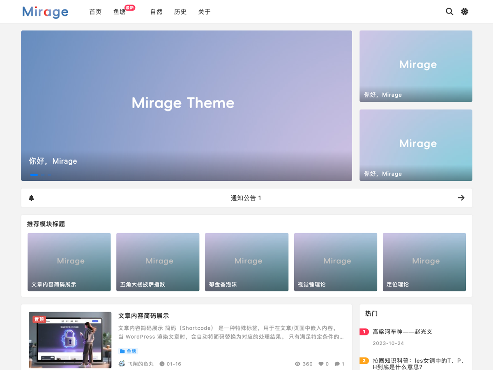
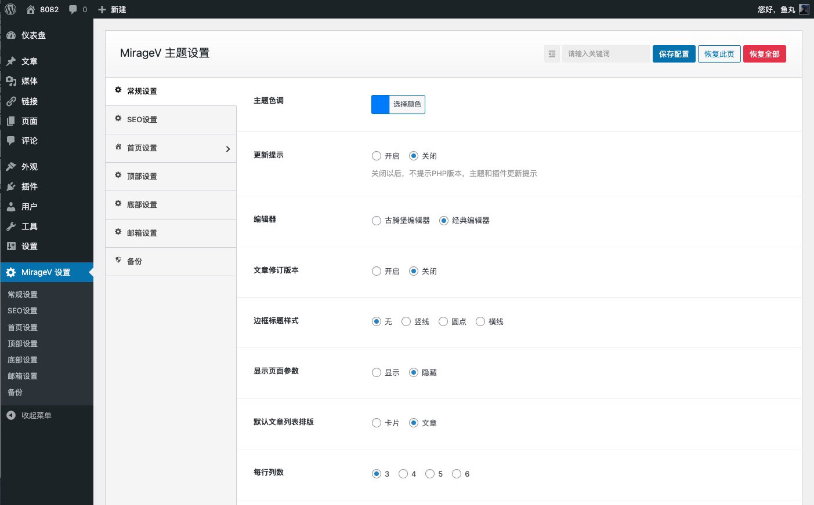
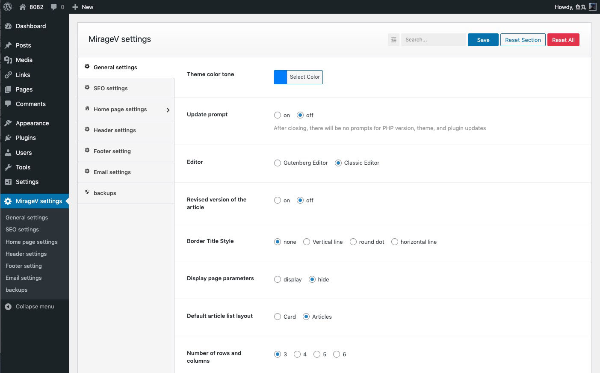

MirageV 主题
======

### 主题简介
MirageV 是一款开源的 WordPress 主题，支持自适应、暗黑模式、多语言等功能，可快速构建高质量的网站。

### 中文配置截图

### 英文配置截图

### 主题特色
- 开源无加密
- 支持白天与暗黑模式
- 支持中文、英文和日文切换
- 首页无刷新加载
- 自适应设计，兼容多种主流浏览器
- 自定义主色调
- 自定义SMTP支持
- 内置SEO功能
- 文章支持点赞、收藏、海报生成分享
- 丰富的小工具
- 侧边栏粘性滚动
- 内置主题设置面板，可导入和备份
- 多级子菜单支持
- 使用最新的的ESM6，使用rollup打包，加载速度快
- 使用原生CSS开发，无前端框架依赖
- 支持关闭网站前端访问，只对外提供接口服务
- 支持后台防暴力破解

### 安装
在发行版页面下载 .zip 文件，在 WordPress 后台 "主题" 页面上传并安装。

提示：请不要直接克隆或下载仓库进行使用，请到发行版中下载使用。

### 文档
- [项目官网](https://vtheme.cn/miragev)
- [版本历史](./CHANGES.md)
- 如果您发现任何BUG，欢迎[联系我](https://vtheme.cn/contact)

### LICENSE
遵循GPL协议，您可自由使用本主题，请保留底部版权

### 演示地址
- [https://miragev.vtheme.cn](https://miragev.vtheme.cn/)

