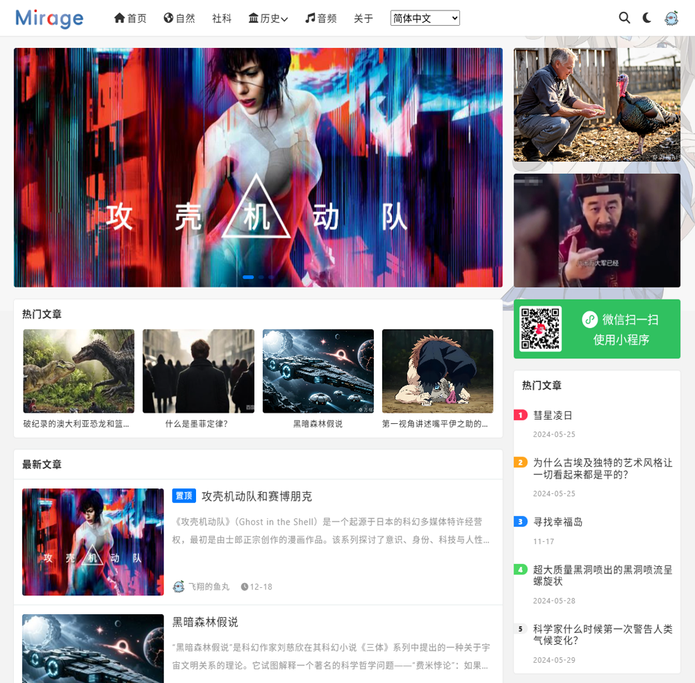

MirageV 主题
======

### 主题简介

MirageV 是一款 WordPress 主题，无需任何代码，轻点鼠标即可对主题和网站进行设置，组合出各种丰富多彩的页面。

### 配置截图

### 主题特色

- 支持白天与暗黑模式
- 自适应设计，兼容多种主流浏览器
- 自定义主色调
- LOGO扫光动画
- 自定义SMTP支持
- 内置SEO功能
- 文章支持点赞、收藏、海报生成分享
- 丰富的小工具
- 侧边栏粘性滚动
- 简介的主题设置面板
- 主题设置可导入和备份
- 多级子菜单支持
- 使用最新的的 ESM6，使用 rollup 打包，加载速度快
- 使用原生CSS开发，没有前端框架依赖
- 可以关闭网站前端，只对外提供接口服务

### 文档

- [版本历史](./docs/changes.md)
- [自定义接口](./docs/api.md)
- 若您发现任何BUG，可以联系我

### LICENSE

遵循GPL协议，非商业用途免费使用，请保留底部版权

### 演示地址

- [https://www.9-f.cn](https://www.9-f.cn/)
- [https://restfulapi.cn](https://restfulapi.cn/)

